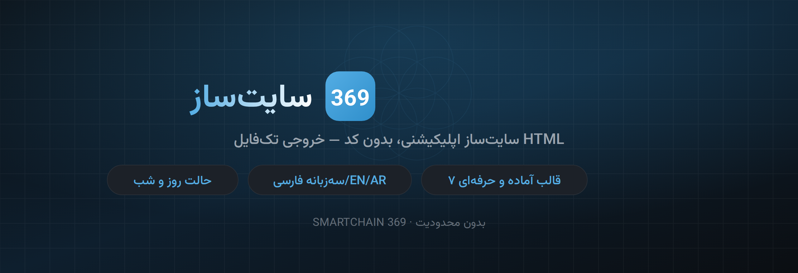
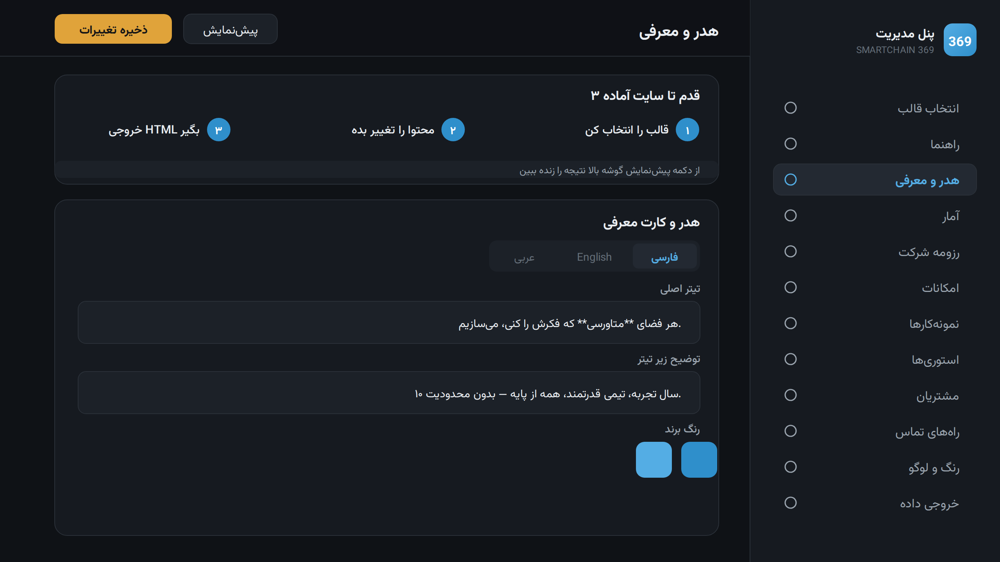
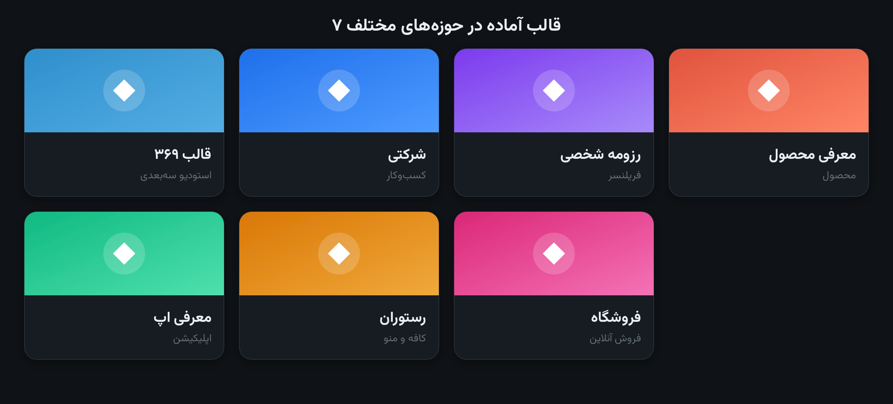

  

 

### بدون یک خط کد، یه سایت معرفی خوشگل و حرفه‌ای بساز

شرکتت، رزومه‌ات، محصولت یا اپت رو معرفی کن — متن‌ها رو تو پنل بذار، یه فایل بگیر، روی هاست بذار. تمام.
هیچ کار خاصی لازم نیست بکنی فقط فایل HTML که اسمش 369-admin.html رو باز کن
بعد تغییراتت رو اعمال کن  
برو تو بخش ورودی و خروجی داده  
روی دانلود سایت کامل کلیک کن  
یه فایل با اسم  index.html بهت میده
حالا هم میتونی رو سیستمت بازش کنی و سایتت رو ببینی و یا هرجایی بفرستی  
عین رزومت ولی این بار حرفه ای  
هم میتونی بزاریش روی هاستت یا سرورت و آنلاین معرفی کنی خودت یا محصولت رو  

میتونی برای هر نفر هم که خواستی بسازی    
هیچ محدودیتی نیست  
رایگان و کامل  

نوش جووووووووووووونت   
 

[این چیه؟](#-سایتساز-۳۶۹-چیه) · [امکانات](#-چیکارا-میکنه) · [قالب‌ها](#-قالبها) · [چطور کار میکنه؟](#-چطور-کار-میکنه) · [ارتباط با من](#-بزن-بریم-حرف-بزنیم)

 

---

## 🚀 سایت‌ساز ۳۶۹ چیه؟

یه **سایت‌ساز** برای وقتی که می‌خوای **خودت یا کارت رو معرفی کنی** — شرکت، رزومه‌ی شخصی، یه محصول، یه اپلیکیشن، رستوران، فروشگاه و هر چیز دیگه.

کارش ساده‌ست:

> **متن‌ها و عکس‌های خودت رو تو پنل می‌ذاری → یه فایل HTML خروجی می‌گیری → روی هاست یا سرورت آپلود می‌کنی.**

همین! نه برنامه‌نویسی بلد باشی، نه دیتابیس بخوای، نه دردسر. **سریع، راحت، و خیلی خوشگل.**

سایتی که می‌سازی **سبک سوپراپلیکیشنی** داره — یعنی هر کسی واردش بشه، سریع و دقیق خودت یا محصولت رو می‌شناسه. هم روی **موبایل** هم روی **دسکتاپ** عالی و تمیز دیده می‌شه.

 

---

## ✨ چیکارا می‌کنه؟

پنل مدیریت — هر بخش رو همین‌جا، زنده و به سه زبان ویرایش می‌کنی

 

- 🎨 **خیلی خوشگله** — طراحی سبک اپلیکیشن موبایلی، با استوری بالای صفحه و منوی پایین
- 📱 **هم موبایل هم دسکتاپ** — روی هر دستگاهی تمیز و حرفه‌ای دیده می‌شه
- 📖 **استوری هم می‌تونی بذاری** — مثل اینستاگرام، با عکس یا متن
- 🌗 **حالت روز و شب** — با یه کلیک
- 🌍 **سه‌زبانه** — فارسی، انگلیسی، عربی
- 🎯 **رنگ و لوگوی خودت** — برند خودت رو روی کل سایت پیاده کن
- 👁 **پیش‌نمایش زنده** — قبل از خروجی، نتیجه رو همون لحظه ببین
- 📄 **خروجی تک‌فایل** — همه‌چیز تو یه `index.html` جمع می‌شه، یه آپلود و تمام
- 🧭 **راهنمای کامل داخل پنل** — تا گیر نکنی، همه‌جا توضیح هست

> **نیازی به بلد بودن برنامه‌نویسی نداری.** فقط متن‌های خودت رو می‌ذاری و خروجی می‌گیری.

 

---

## 🗂 قالب‌ها

هفت تا قالب آماده داری که نه‌فقط محتواشون، بلکه **شکل و چیدمانشون هم فرق داره**. یکی رو که به کارت می‌خوره انتخاب کن، متنش رو با مال خودت عوض کن، تمام.

 

| قالب | به درد چی می‌خوره |
|------|------------------|
| 🧊 **۳۶۹** | استودیو سه‌بعدی، متاورس، شرکت فناوری *(قالب پیش‌فرض)* |
| 🏢 **شرکتی** | معرفی شرکت، کسب‌وکار، خدمات |
| 👤 **رزومه شخصی** | فریلنسر، طراح، برنامه‌نویس، نمونه‌کار شخصی |
| 📦 **معرفی محصول** | یه محصول فیزیکی یا دیجیتال |
| 📱 **معرفی اپلیکیشن** | اپ موبایل، با دکمه‌ی دانلود |
| 🍽 **رستوران و کافه** | منو، معرفی فضا، رزرو |
| 🛍 **فروشگاه** | نمایش و معرفی محصولات |

 

---

## 🛠 چطور کار می‌کنه؟

پروژه دو تا فایل داره. تو فقط با اولیش کار داری:

| فایل | چیه |
|------|------|
| **`369-admin.html`** | **پنل مدیریت** — اینجا همه‌چیز رو می‌سازی و تنظیم می‌کنی |
| **`369-app-final.html`** | موتور سایت — خود سایتیه که به بازدیدکننده نشون داده می‌شه *(دستش نزن)* |

### قدم به قدم:

**۱.** فایل **`369-admin.html`** رو با مرورگر باز کن *(فقط دابل‌کلیک)*

**۲.** از منوی **«انتخاب قالب»** یه قالب بردار

**۳.** متن‌ها، عکس‌ها، رنگ و لوگو رو با مال خودت عوض کن — هر لحظه با **«پیش‌نمایش»** نتیجه رو ببین

**۴.** برو سراغ **«خروجی و ورودی داده»** و دکمه‌ی **«دانلود سایت کامل»** رو بزن

**۵.** فایل `index.html` که گرفتی رو روی **هاست یا سرورت** آپلود کن

**همین! سایتت بالا اومد. ✅**

 

---

## 💡 چند تا نکته

- **کلمه‌ی رنگی:** هر کلمه‌ای رو که بخوای تو سایت رنگی بشه، بین دو تا ستاره بذار. مثلاً: `فضای **متاورسی**`
- **عکس‌ها:** مستقیم از گوشی یا کامپیوترت آپلود می‌شن و داخل همون فایل خروجی جمع می‌شن — نیازی به آپلود جدا نیست.
- **سه زبان:** تو هر بخش، تب‌های فارسی / English / عربی رو جدا پر کن.
- **بکاپ:** اگه خواستی محتوات رو نگه داری یا به یه دستگاه دیگه ببری، از «خروجی بکاپ» فایل بگیر و بعداً «وارد کن».
- **عکس سنگین نذار:** چون همه‌چیز تو یه فایل جمع می‌شه، عکس‌های خیلی بزرگ حجم فایل رو بالا می‌برن. عکس معمولی هیچ مشکلی نداره.

 

---

## ❓ سوالای پرتکرار

**باید برنامه‌نویسی بلد باشم؟**
نه. اصلاً. فقط متن‌ها و عکس‌هات رو می‌ذاری و خروجی می‌گیری.

**سایتم به سرور خاصی نیاز داره؟**
نه. فایل خروجی کاملاً مستقله. روی هر هاستی، گیت‌هاب پیجز، یا حتی همون فایل روی کامپیوترت باز می‌شه.

**چند تا سایت می‌تونم بسازم؟**
هرچقدر بخوای. برای هر کدوم محتوا رو عوض کن و یه خروجی جدا بگیر.

**عکس‌ها کجا ذخیره می‌شن؟**
داخل همون فایل خروجی. نیازی به جای دیگه نیست.

 

---

## 📬 بزن بریم حرف بزنیم

این ابزار رو **سامان ولی‌خانی** ساخته.

اگه یه **سایت حرفه‌ای**، **وب‌اپ اختصاصی**، یا یه **تجربه‌ی تعاملی و سه‌بعدی** برای کارت می‌خوای — از ایده تا تحویل کنارتم. بزن بریم حرف بزنیم:

 

**📞 0912 806 0146**

 

SMARTCHAIN 369 · بدون محدودیت

 

---

اگه به کارت اومد، یه ⭐ بذار — انگیزه‌ی نسخه‌های بعدیه.

